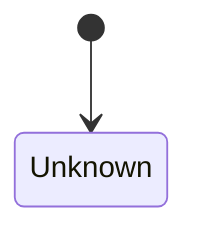

<!-- d2a:pending -->
# S4 状态演化

生成时先回答：应该跟踪的单一对象或流程是什么？它有哪三个到六个状态阶段？主要状态迁移由什么触发？状态在哪里存储、观测或重建？
把迁移结论及真实文件、符号、证明内容和置信度另行写入 `architecture/evidence/04_state_evolution.json`。

优先关注状态推进而不是实现细节。初稿完成后依次进行压缩修订、去术语修订和口语化简化修订。

最终完成文件时，删除本模板的所有说明，只保留一个 Mermaid `stateDiagram-v2` 代码块，不得附加标题、段落、列表或解释文字。状态名和迁移标签必须来自真实实现。

